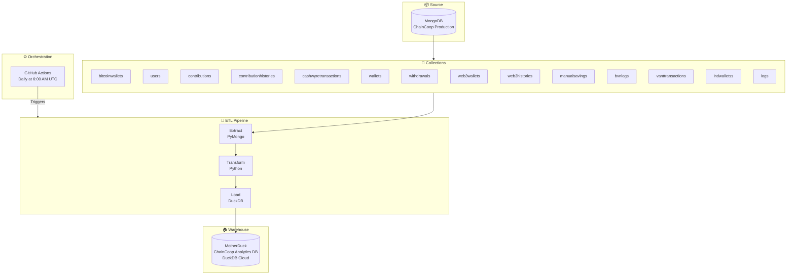

# mongo-to-motherduck-etl

> Automated MongoDB to MotherDuck sync pipeline for **ChainCoop** — syncing cooperative financial data daily via GitHub Actions.

---

## Data Flow



---

## Stack

| Layer | Technology |
|---|---|
| Source | MongoDB |
| Orchestration | GitHub Actions |
| Transformation | Python |
| Warehouse | DuckDB + MotherDuck |

---

## Repository Structure

```
mongo-to-motherduck-etl/
├── .github/workflows/
│   └── sync.yml              # Daily sync workflow
├── sync_jobs/
│   └── etl_pipeline.py       # Core ETL logic
├── config.py                 # Collection config
├── main.py                   # Pipeline entry point
├── requirements.txt
└── README.md
```

---

## Key Features

- **Daily automated sync** — runs every day at 6:00 AM UTC
- **14 collections** — covers wallets, users, contributions, transactions and more
- **Error handling** — failed collections are logged and skipped without stopping the pipeline
- **Persistent logging** — sync activity written to `sync_log.txt` and committed back to the repo
- **Manual trigger** — pipeline can be triggered on demand via `workflow_dispatch`

---

## Local Development

```bash
# Clone
git clone https://github.com/Chain-Coop/mongo-to-motherduck-etl.git
cd mongo-to-motherduck-etl

# Install dependencies
pip install -r requirements.txt

# Set environment variables
export MONGO_URI=your_mongodb_connection_string
export PASSWORD=your_password
export MOTHERDUCK_TOKEN=your_motherduck_token

# Run
python main.py
```

---

## GitHub Actions Secrets

| Secret | Description |
|---|---|
| `MONGO_URI` | MongoDB connection string |
| `PASSWORD` | Database password |
| `MOTHERDUCK_TOKEN` | MotherDuck authentication token |

---

## License

MIT